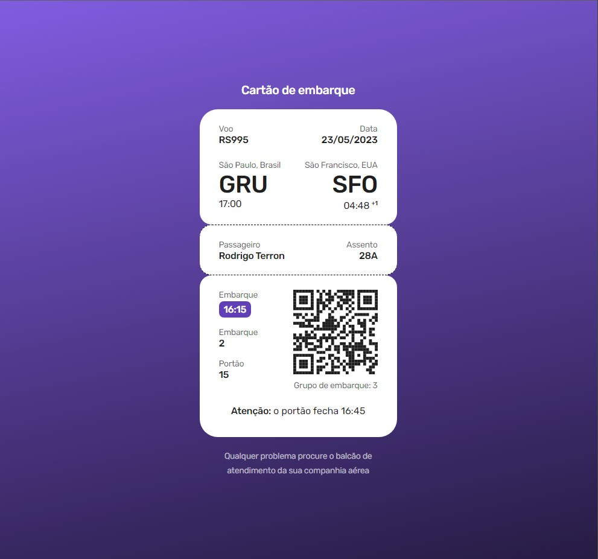

# Cartão de embarque

Projeto de layout de um cartão de embarque utilizando html e css

## Preview

## 🔖 Layout

Você pode visualizar o layout do projeto através <a href="https://www.figma.com/file/Ac9BJ4ut7i9T4tMVSjMiUR/%23boraCodar---Desafio-6-(Community)?node-id=1%3A7&t=kqDMJ0Mx1Ujef0yN-1">- Figma</a>. É necessário ter conta no [Figma](https://figma.com) para acessá-lo.
